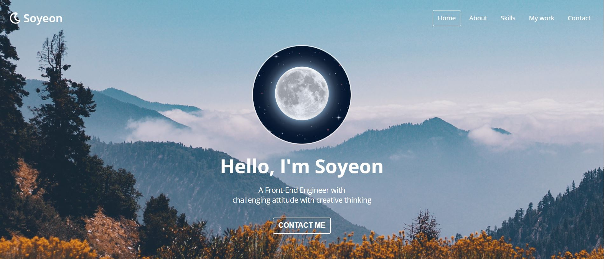

# Soyeon's Porfolio Website

<h2>개요</h2>
클론코딩 강의를 바탕으로 제작한 반응형 포트폴리오 웹사이트입니다.
 

<h3>목차</h3>
<ol>
    <li>Home</li>
    <li>About</li>
    <li>Skills</li>
    <li>My work</li>
    <li>Contact</li>
</ol>
 

<h3>사용한 기술스택</h3>
HTML, CSS, JavaScript
 

<h3>업데이트 내역</h3>
<ul>
    <li>1v</li>
</ul>

<h3>정보</h3>
장소연- ssso.pro1@gmail.com
https://github.com/ssso-pro1/ssso-pro1.github.io
